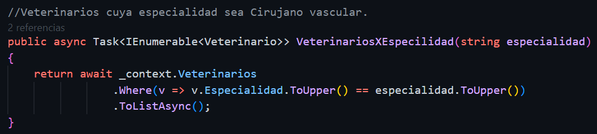

# Proyecto de Administración para Veterinaria : :cat: :dog:

El proyecto de desarrollo de software tiene como objetivo principal la creación de un sistema de administración para una veterinaria. Este sistema permitirá a los administradores y al personal de la veterinaria gestionar de manera eficiente y efectiva todas las actividades relacionadas con la atención de mascotas y la gestión de clientes.

El sistema contará con diferentes módulos que abarcarán áreas clave como el registro de pacientes, la programación de citas, el seguimiento de tratamientos médicos, la gestión de inventario de medicamentos y productos, así como la generación de reportes y estadísticas relevantes para la toma de decisiones.

El desarrollo se realizará utilizando la tecnología NetCore Version 7.0, que proporciona un entorno robusto y escalable para la creación de aplicaciones web. Se implementarán las mejores prácticas de desarrollo de software para garantizar la calidad y fiabilidad del sistema.

El proyecto de administración de veterinaria tiene como objetivo mejorar la eficiencia y la experiencia del cliente, al tiempo que facilita la gestión interna de la veterinaria. Se espera que este sistema contribuya positivamente al crecimiento y éxito del negocio.


# Consultas 🔍
## Índice :paw_prints: 
#### Grupo A
- [Consulta 1: Veterinarios Cirujano Vascular](#consulta-1-veterinarios-cirujano-vascular)
- [Consulta 2: Medicamentos de Laboratorio Genfar](#consulta-2-medicamentos-de-laboratorio-genfar)
- [Consulta 3: Mascotas de Especie Felina](#consulta-3-mascotas-de-especie-felina)
- [Consulta 4: Propietarios y sus Mascotas](#consulta-4-propietarios-y-sus-mascotas)
- [Consulta 5: Medicamentos con Precio de Venta Mayor a 50,000](#consulta-5-medicamentos-con-precio-de-venta-mayor-a-50000)
- [Consulta 6: Mascotas Atendidas por Vacunación en el Primer Trimestre de 2023](#consulta-6-mascotas-atendidas-por-vacunación-en-el-primer-trimestre-de-2023)

#### Grupo B
- [Consulta 1: Listar todas las mascotas agrupadas por especie](#consulta-1-listar-todas-las-mascotas-agrupadas-por-especie)
- [Consulta 2: Listar todos los movimientos de medicamentos y el valor total de cada movimiento](#consulta-2-listar-todos-los-movimientos-de-medicamentos-y-el-valor-total-de-cada-movimiento)
- [Consulta 3: Listar las mascotas que fueron atendidas por un determinado veterinario](#consulta-3-listar-las-mascotas-que-fueron-atendidas-por-un-determinado-veterinario)
- [Consulta 4: Listar los proveedores que me venden un determinado medicamento](#consulta-4-listar-los-proveedores-que-me-venden-un-determinado-medicamento)
- [Consulta 5: Listar las mascotas y sus propietarios cuya raza sea Golden Retriever](#consulta-5-listar-las-mascotas-y-sus-propietarios-cuya-raza-sea-golden-retriever)
- [Consulta 6: Listar la cantidad de mascotas que pertenecen a una raza](#consulta-6-listar-la-cantidad-de-mascotas-que-pertenecen-a-una-raza)


### Consulta 1: Veterinarios Cirujano Vascular.
- En el siguiente endpoint realizamos la consulta mediante Thunder Client, donde obtenemos una respuesta despues de filtrar todos los registros por una especialidad especifica

Esta es la implementacion de linq para realizar la consulta a la base de datos Mysql

### Consulta 2: Medicamentos de laboratorio Genfar.

# **Consulta 3:** Mostrar las mascotas registradas cuya especie sea felina.

# **Consulta 4:** Listar los propietarios y sus mascotas.

# **Consulta 5:** Listar los medicamentos que tengan un precio de venta mayor a 50,000.

# **Consulta 6:** Listar las mascotas que fueron atendidas por motivo de vacunación en el primer trimestre del 2023.

```aaaaaa@homajajsjhsjshd``