# Proyecto de Administración para Veterinaria : :cat: :dog:

El proyecto de desarrollo de software tiene como objetivo principal la creación de un sistema de administración para una veterinaria. Este sistema permitirá a los administradores y al personal de la veterinaria gestionar de manera eficiente y efectiva todas las actividades relacionadas con la atención de mascotas y la gestión de clientes.

El sistema contará con diferentes módulos que abarcarán áreas clave como el registro de pacientes, la programación de citas, el seguimiento de tratamientos médicos, la gestión de inventario de medicamentos y productos, así como la generación de reportes y estadísticas relevantes para la toma de decisiones.

El desarrollo se realizará utilizando la tecnología NetCore Version 7.0, que proporciona un entorno robusto y escalable para la creación de aplicaciones web. Se implementarán las mejores prácticas de desarrollo de software para garantizar la calidad y fiabilidad del sistema.

El proyecto de administración de veterinaria tiene como objetivo mejorar la eficiencia y la experiencia del cliente, al tiempo que facilita la gestión interna de la veterinaria. Se espera que este sistema contribuya positivamente al crecimiento y éxito del negocio.

## Requerimientos Funcionales
1. Autenticación y autorización:
    - El sistema debe implementar protección en los endpoints utilizando JWT (JSON Web Tokens). El token tiene una duracion de 1 minuto.
    - Se debe implementar refresh token.
    - Debe restringir las peticiones a los endpoints según los roles de los usuarios.
2. Se debe permitir realizar procesos de creacion, edicion, eliminacion y listado de informacion de cada una de las tablas
3. El backend debe permitir restringir peticiones consecutivos usando tecnicas de limitacion por IP.
4. El backend debe permitir realizar la paginacion en  las peticiones get de todos los controladores.
5. Los controladores deben implementar 2 versiones diferentes (Query y Header)

#### Ejecucion del Proyecto:
Ingresamos a la careta API y appsettings.json
Configurar Server, user, password y database segun la información de usuario en mysql.


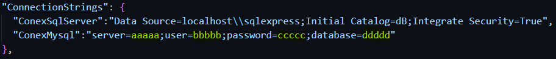
Crear la migración con el siguiente comando en consola, ubicado en la raiz del proyecto. 
```
  dotnet ef migrations add InitialCreated --project .\Persistencia\ --startup-project .\API\ --output-dir .\Data\Migrations
```

Despues generamos el comando de actualizacion para enviar a la base de datos.
```
  dotnet ef database update --project .\Persistencia\ --startup-project .\API\
```

Ejecución de la aplicacion desde la raiz del proyecto utilizando swagger.
```
 dotnet watch run --project .\API\
```
#Esta es la implementacion de cada una de las consultas con su respectiva evidencia.

# Consultas 🔍:paw_prints: 
### Grupo A

 #### 🔴 Crear un consulta que permita visualizar los veterinarios cuya especialidad sea Cirujano vascular.  ✅
```csharp
http://localhost:5089/Veterinaria/Veterinario/Especialidad/{especialidad}
```
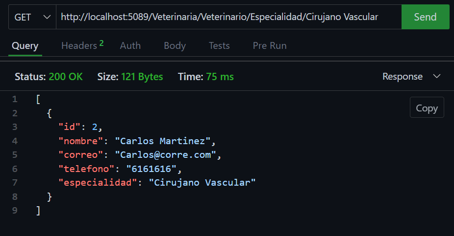{width=500px height=400px}


 #### 🔴 Listar los medicamentos que pertenezcan a el laboratorio Genfar  ✅
```csharp
http://localhost:5089/Veterinaria/Laboratorio/ConMedicamentos/{laboratorio}
```
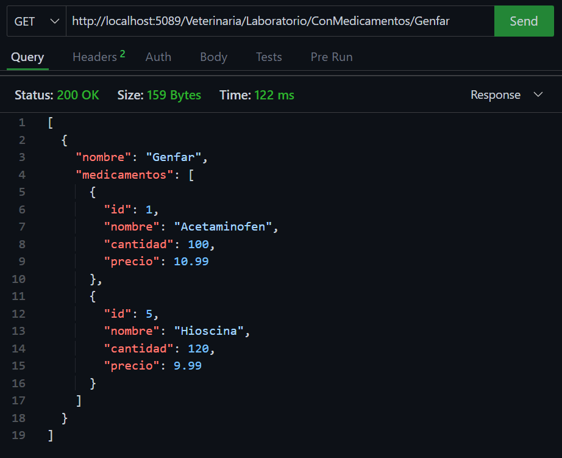{width=500px height=400px}


 #### 🔴 Mostrar las mascotas que se encuentren registradas cuya especie sea felina.  ✅
```csharp
http://localhost:5089/Veterinaria/Especie/ConMascotas/{especie}
```
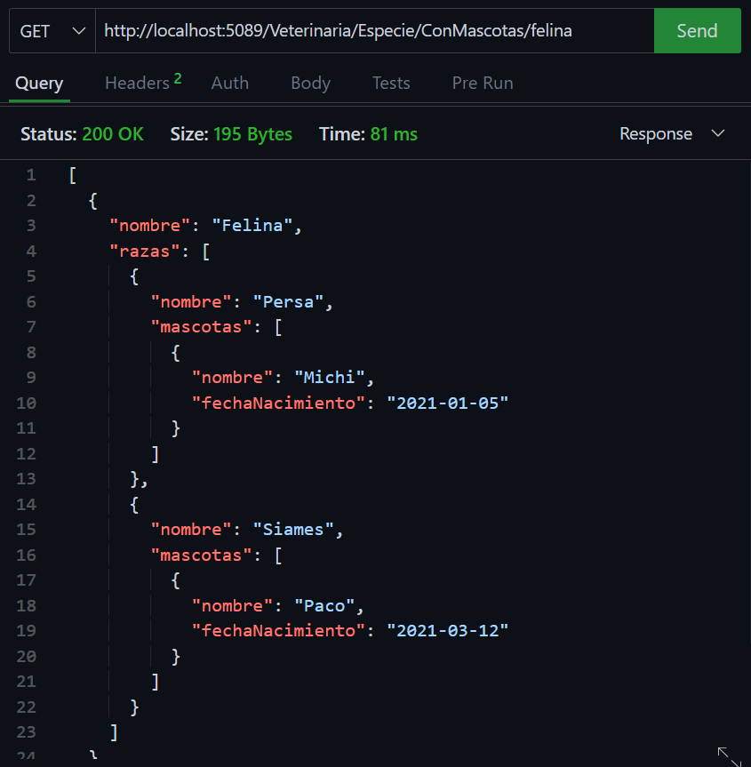{width=500px height=400px}


 #### 🔴 Listar los propietarios y sus mascotas.  ✅
```csharp
http://localhost:5089/Veterinaria/Propietario/ConMascotas
```
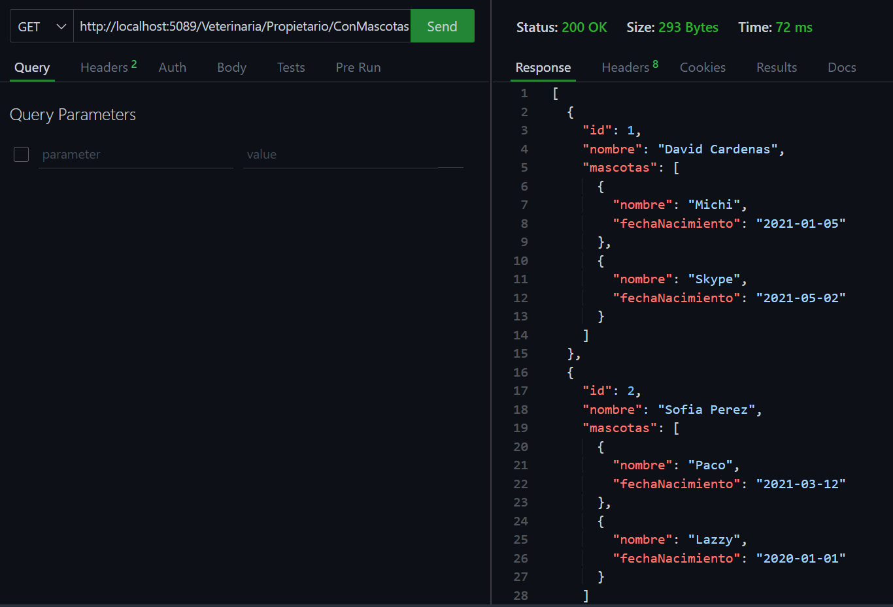{width=500px height=400px}


 #### 🔴 Listar los medicamentos que tenga un precio de venta mayor a 50000  ✅
```csharp
http://localhost:5089/Veterinaria/Medicamento/PrecioMayorA/{precio}
```
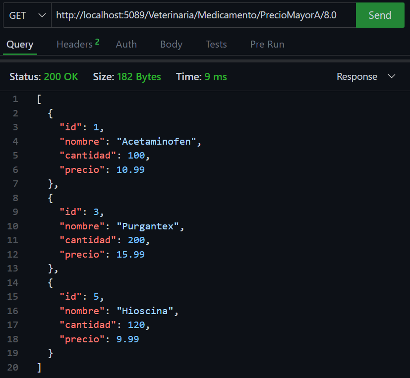{width=500px height=400px}


 #### 🔴 Listar las mascotas que fueron atendidas por motivo de vacunacion en el primer trimestre del 2023  ✅
```csharp
http://localhost:5089/Veterinaria/Mascota/AtendidasXMotivo/{motivo}/{anio}/{trimestre}
```
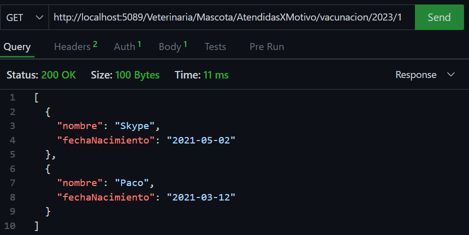{width=500px height=400px}


## Grupo B
 #### 🔴 Listar todas las mascotas agrupadas por especie.  ✅
```csharp
  http://localhost:5089/Veterinaria/Especie/ConMascotas
  ```
  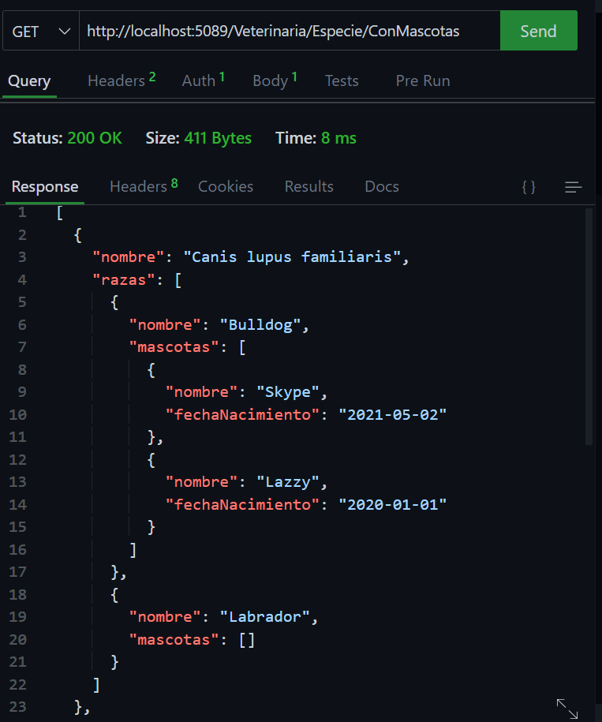{width=500px height=400px}


 #### 🔴 Listar todos los movimientos de medicamentos y el valor total de cada movimiento. ✅
```csharp
  http://localhost:5089/Veterinaria/Movimiento/ValorTotal
  ```
  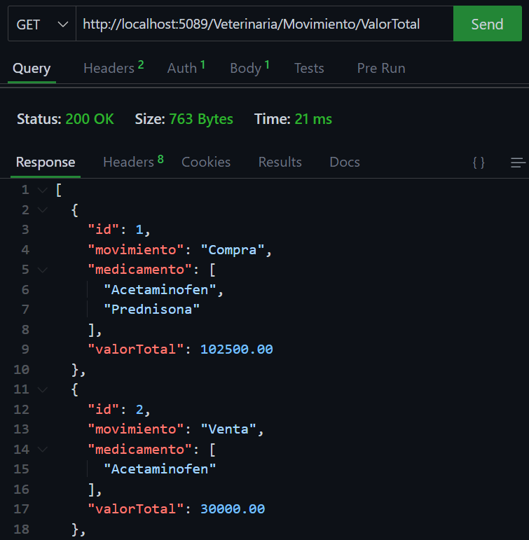{width=500px height=400px}

  
 #### 🔴 Listar las mascotas que fueron atendidas por un determinado veterinario.  ✅
```csharp
  http://localhost:5089/Veterinaria/Veterinario/ConMascotasAtendidas/{nombreVeterinario}
  ```
  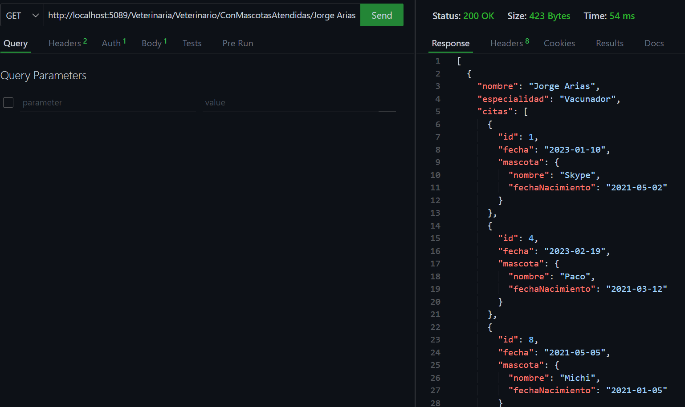{width=500px height=400px}


#### 🔴 Listar los proveedores que me venden un determinado medicamento.  ✅
```csharp
  http://localhost:5089/Veterinaria/Medicamento/IncluyeProveedor/{medicamento}
  ```
  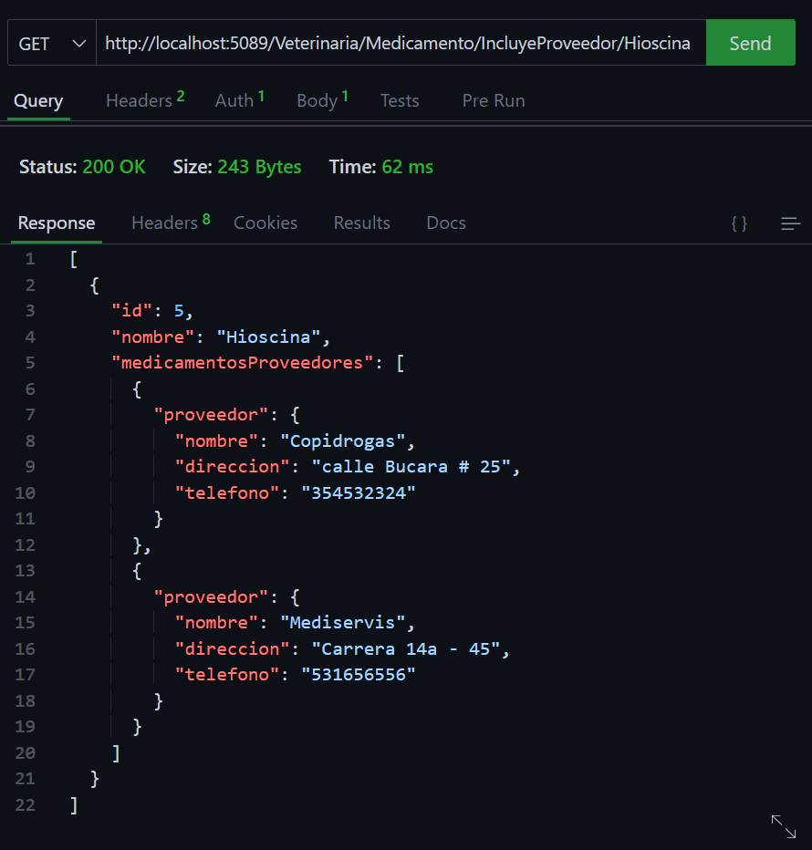{width=500px height=400px}


 #### 🔴 Listar las mascotas y sus propietarios cuya raza sea Golden Retriver  ✅
```csharp
  http://localhost:5089/Veterinaria/Raza/MascotaConPropietario/{raza}
  ```
  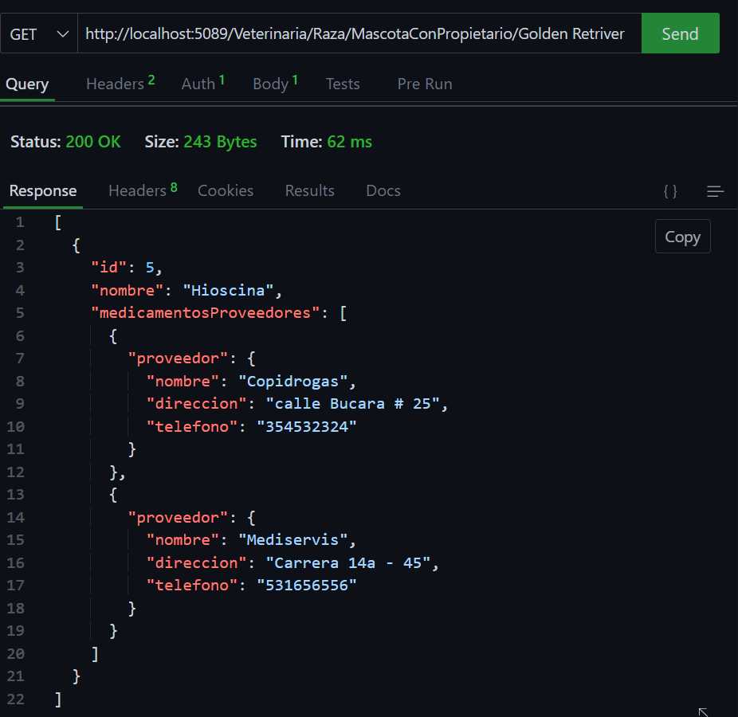{width=500px height=400px}


 #### 🔴 Listar la cantidad de mascotas que pertenecen a una raza  ✅
```csharp
  http://localhost:5089/Veterinaria/Raza/TotalMascotasPorRaza
```
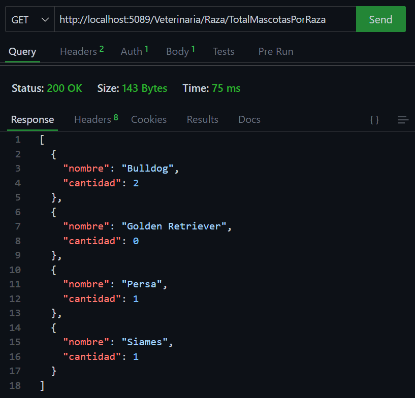{width=500px height=400px}

